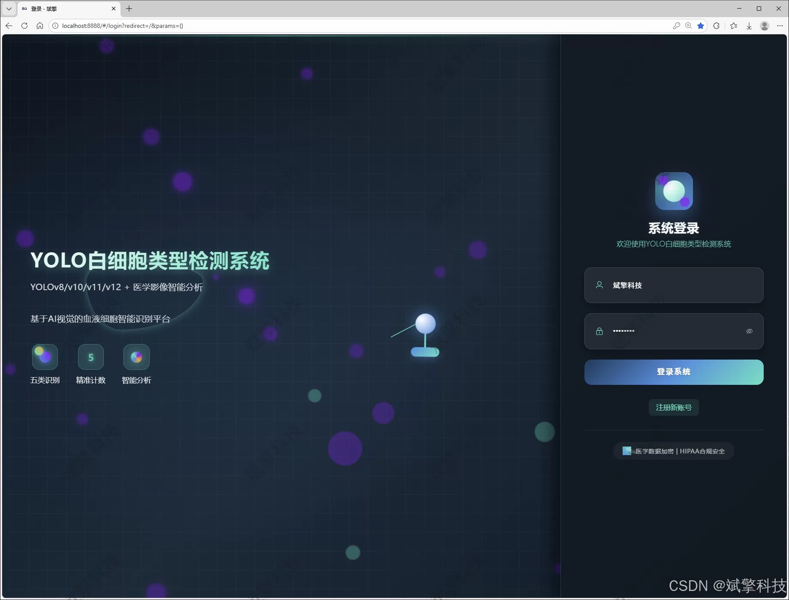
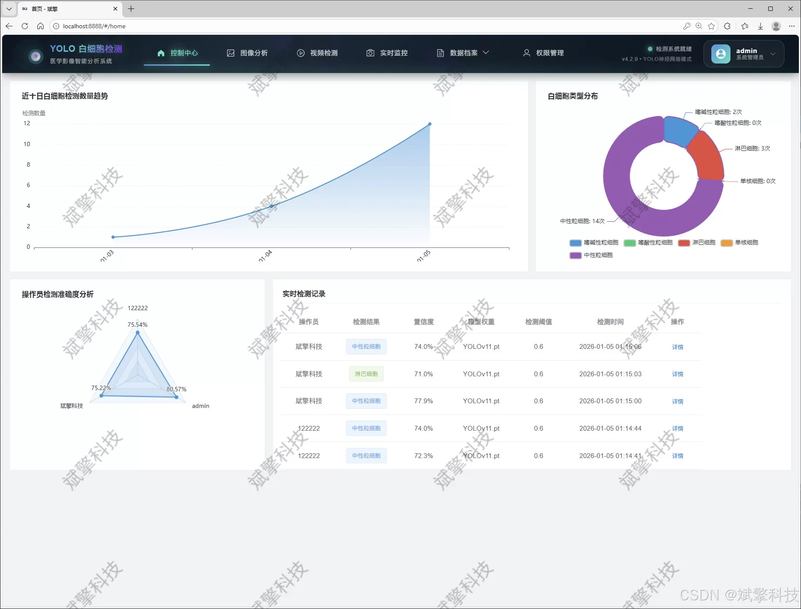
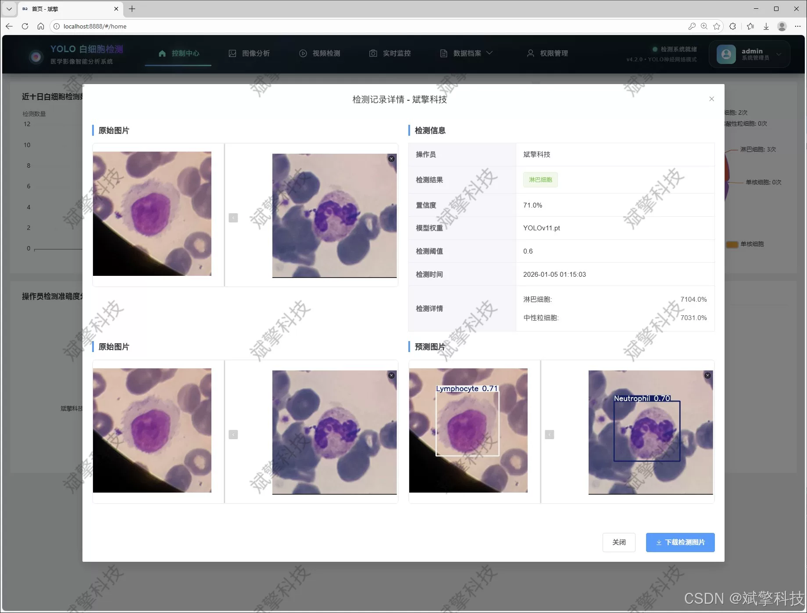
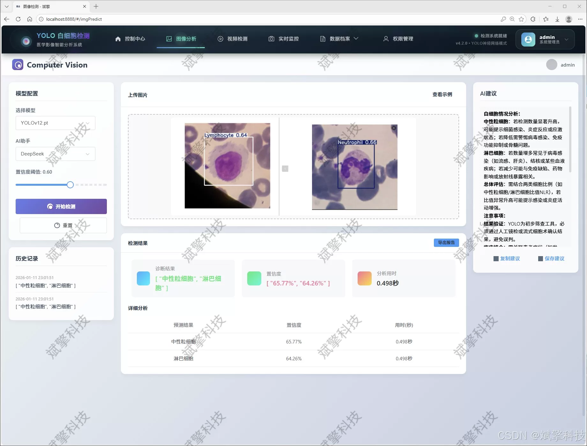
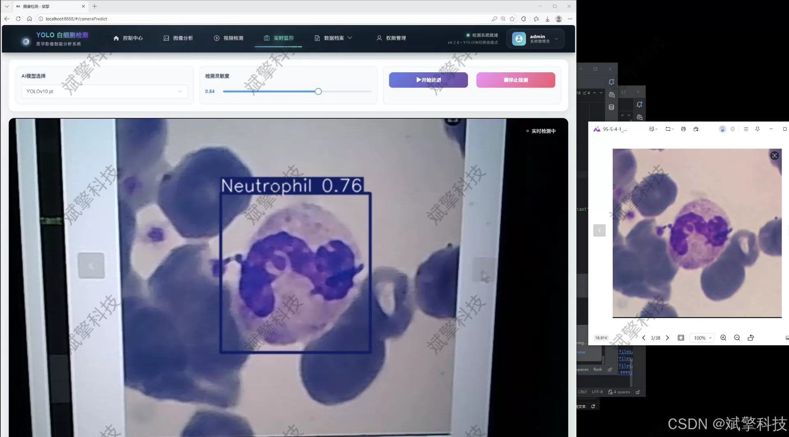
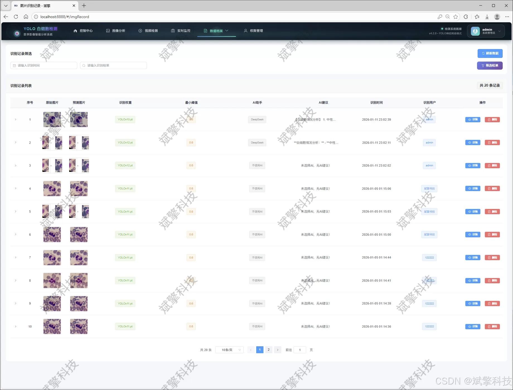
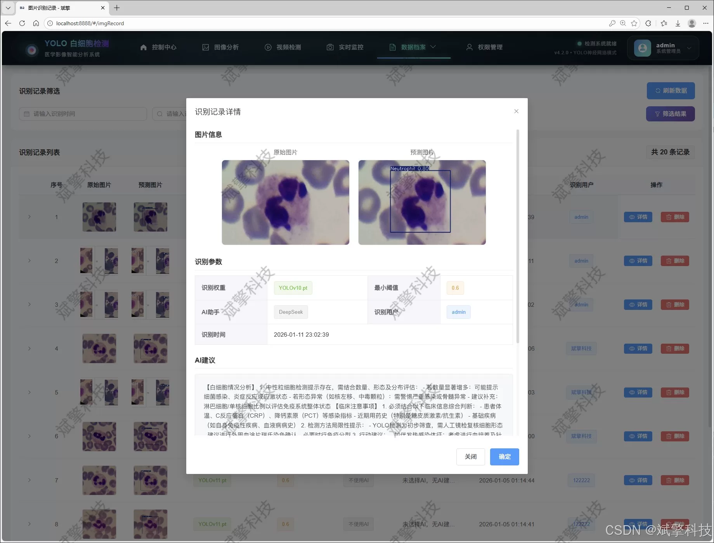
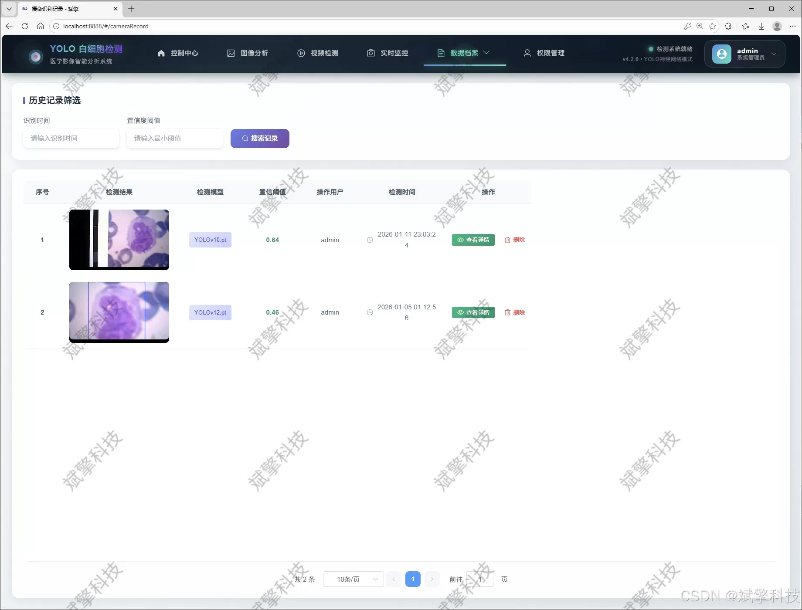
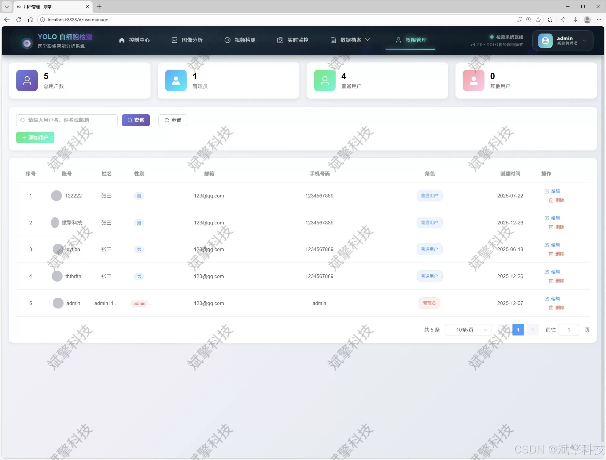

# YOLO+DeepSeek White Blood Cell Detection System

## Body

YOLO+DeepSeek white blood cell detection system is based on YOLO deep learning and the big model of DeepSeek, which can detect the types of white blood cells (DeepSeek intelligent analysis + web interface + front-end separation + YOLO data + YOLOv8/YOLOv10/YOLOv11/YOLOv12).

The project design and implementation of a leukocyte type detection and intelligent analysis system based on SpringBoot architecture and the latest YOLO series model. The system aims to solve the problems of low efficiency and subjectivity in traditional manual microscopic examination, and achieve rapid and accurate recognition and classification of five main types of leukocytes (basophils, eosinophils, lymphocytes, monocytes, neutrophils) in peripheral blood smear.

The system adopts the modern Web development model of "front-end and back-end separation", with SpringBoot as its core. It integrates MySQL database to build a stable and efficient data service and business logic layer. The front-end provides a friendly interaction interface. The core detection model integrates four cutting-edge target detection algorithms: YOLOv8, YOLOv10, YOLOv11, and YOLOv12, allowing users to switch according to their needs for performance comparison. The system not only supports online detection of images, videos, and real-time camera streams but also stores and manages all recognition records (including images, detection results, and timestamps) in a structured manner.

Furthermore, this system innovatively integrates the intelligent analysis module of DeepSeek large language model, which can interpret and expand knowledge on the detection results of YOLO model, generate more clinical description reports that are closer to the needs of diagnosis, and enhance the value of the system's auxiliary diagnosis. The system also has complete user authentication, permission management (administrator/general user), data visualization dashboard, and personal center functional modules, ensuring the practicality and security of the system.

Functional module

✅ User Login and Registration: Supports password detection, saves to MySQL database.

✅ Supports four YOLO model switches, YOLOv8, YOLOv10, YOLOv11, YOLOv12.

✅ Information Visualization, Data Visualization.

✅ Image detection supports AI analysis functions, deepseek and Qianwen.

✅ Supports image detection, video detection, and real-time camera detection. The results are saved to a MySQL database.

✅ Picture recognition record management, video recognition record management and camera recognition record management.

✅ User Management Module, administrators can add, delete, modify, and query users.

✅ Personal center, can modify their own information, password name profile picture and so on.

There is no Lunwen writing service, nor any Lunwen.

## Images

## Payment

Here is a pay link on Stripe ( https://buy.stripe.com/3cs8yP7sY87d0vu9AB ). Please contact me lonlonago@foxmail.com after funding $89, and I will send you a complete data files , thank you!

